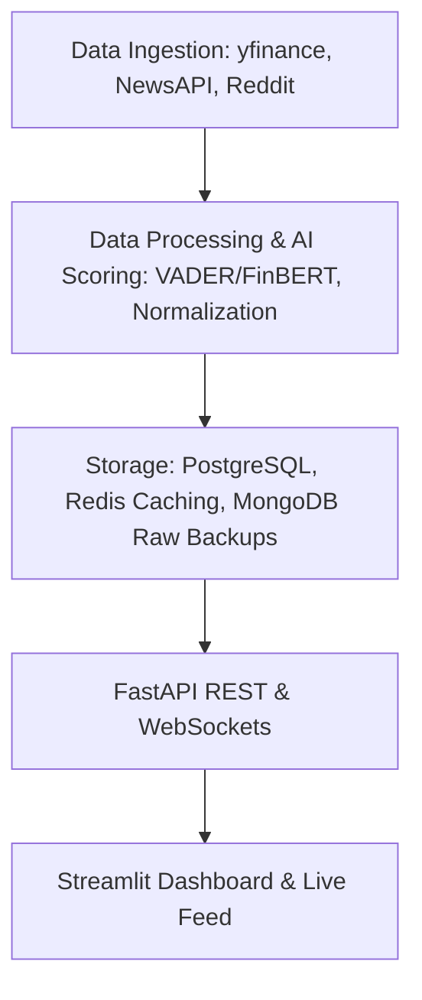

# PulseIQ — Real-Time Market Sentiment & Stock Intelligence Platform

PulseIQ is a real-time full-stack Python application that ingests financial news headlines and social media posts, scores their sentiment using AI models, correlates the sentiment with real-time stock price movements, and provides data insights through a FastAPI REST/WebSocket API and a Streamlit dashboard.

## Tech Stack
- **Backend & API**: Python, FastAPI, Uvicorn, WebSockets
- **Sentiment Analysis**: FinBERT (Finance-tuned Transformer via Hugging Face) / VADER (Lexicon-based)
- **Data Ingestion**: yfinance (Stock prices), NewsAPI (News headlines), Reddit API (Social media scraping)
- **Data Processing**: Pandas, SciPy (Pearson correlation)
- **Databases**: PostgreSQL (Structured scores & metrics), Redis (Caching & live pub-sub), MongoDB (Raw article backups)
- **Orchestration**: APScheduler (Cron/Interval pipeline execution)
- **Visualization**: Streamlit, Plotly
- **Deployment**: Docker, Docker Compose

## Architecture Overview



1. **Ingestion**: Fetches stock prices, news articles, and Reddit posts at regular intervals.
2. **Processing**: Normalizes content, runs sentiment analysis, and calculates Pearson correlation coefficient hourly between sentiment and stock price changes.
3. **Storage**: Saves structured records to PostgreSQL, backs up raw JSON in MongoDB, and caches live sentiment averages/prices in Redis.
4. **API**: Exposes HTTP endpoints for querying structured data and a WebSocket channel for real-time updates.
5. **Dashboard**: Renders a premium visual interface presenting market trends, sentiment scores, correlation stats, and live tick updates.

## Quick Start Instructions

### Prerequisites
- Python 3.9+
- Docker & Docker Compose (optional, for databases)

### 1. Set Up Environment Variables
Copy `.env.example` to `.env` and fill in any keys if available (the application runs out-of-the-box using mock generators if keys/databases are unavailable):
```bash
cp .env.example .env
```

### 2. Install Dependencies
Create a virtual environment and install requirements:
```bash
python3 -m venv venv
source venv/bin/activate
pip install -r requirements.txt
```

### 3. Spin Up Databases (Optional)
If you have Docker installed, start PostgreSQL, Redis, and MongoDB in the background:
```bash
docker-compose up -d
```

### 4. Start the Application Components
Open three terminal windows (make sure virtualenv is activated in each):

* **Scheduler (Data Ingest & Pipeline)**:
  ```bash
  python scheduler.py
  ```

* **API Server**:
  ```bash
  uvicorn api.main:app --port 8000 --reload
  ```

* **Streamlit Dashboard**:
  ```bash
  streamlit run dashboard/app.py
  ```

## API Endpoints

| Method | Endpoint | Description |
|:---|:---|:---|
| **GET** | `/health` | Service health status and database connection states. |
| **GET** | `/scores` | Retrieves the latest average sentiment scores and stock prices for all watchlist symbols. |
| **GET** | `/scores/{symbol}` | Retrieves historical sentiment and stock price records for a specific symbol. |
| **GET** | `/articles` | Fetches recently ingested articles and social posts with their individual sentiment scores. |
| **GET** | `/correlation` | Returns hourly Pearson correlation coefficients computed between sentiment and stock price changes. |
| **WebSocket** | `/ws/live` | Real-time WebSocket feed broadcasting live sentiment-price update payloads. |
