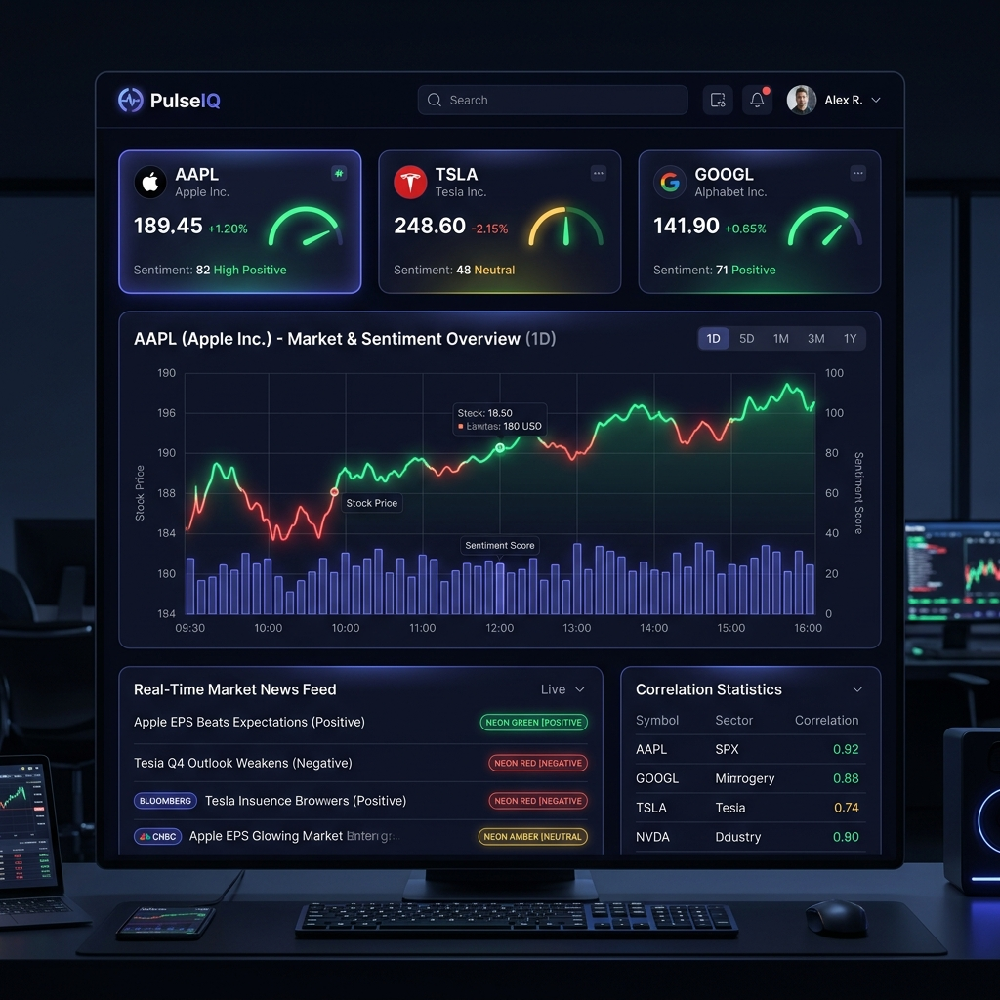

# PulseIQ

> Real-time market sentiment intelligence — tracks financial news, Reddit, and live stock prices, scores sentiment with NLP, and surfaces correlation between public mood and price movement.




## What it does

PulseIQ ingests financial news headlines, Reddit posts from r/wallstreetbets and r/investing, and live OHLCV stock prices every 5 minutes. It runs NLP sentiment analysis on every article (VADER by default, FinBERT via config flag), stores results across three purpose-built databases, and exposes a real-time REST + WebSocket API consumed by a Next.js dashboard.

The core insight: compute Pearson correlation between hourly-aggregated sentiment scores and intraday price delta per ticker — turning raw news into a quantified signal.

## Architecture
NewsAPI + Reddit PRAW + yfinance

↓

NLP Sentiment Engine (VADER / FinBERT)

↓

┌───────────────────────────────────────┐

│  PostgreSQL    Redis       MongoDB    │

│  (history)    (live cache) (raw docs) │

└───────────────────────────────────────┘

↓

FastAPI REST + WebSocket API

↓

Next.js 14 Dashboard (Framer Motion + Recharts)

## Tech Stack

| Layer | Technology |
|-------|-----------|
| Backend | Python 3.9, FastAPI, Celery, Celery Beat |
| NLP | VADER Sentiment, FinBERT (ProsusAI) |
| Databases | PostgreSQL, Redis, MongoDB |
| Frontend | Next.js 14, TypeScript, Tailwind CSS, Framer Motion |
| DevOps | Docker, docker-compose |
| Data | Pandas, SciPy (Pearson correlation) |

## Prerequisites

- Python 3.9+
- Node.js 18+
- Docker + Docker Compose (recommended)
- Free API keys: [NewsAPI](https://newsapi.org) · [Reddit App](https://www.reddit.com/prefs/apps)

## Quick Start

**Option A — Docker (recommended):**
```bash
git clone https://github.com/Azeez-2614/Pulseiq
cd Pulseiq
cp .env.example .env        # Fill in your API keys
docker-compose up --build   # Starts all services
```

**Option B — Manual:**
```bash
# Backend
cp .env.example .env
pip install -r requirements.txt
python -m celery -A celery_app worker --loglevel=info &   # Celery worker
python -m celery -A celery_app beat --loglevel=info &     # Celery beat scheduler
uvicorn api.main:app --reload &                           # API server

# Frontend
cd frontend
npm install
npm run dev                              # http://localhost:3000
```

## API Reference

All endpoints require `X-API-Key` header.

| Method | Endpoint | Rate Limit | Description |
|--------|----------|------------|-------------|
| GET | `/health` | None | Service health check |
| GET | `/scores` | 60/min | All current sentiment scores |
| GET | `/scores/{symbol}` | 60/min | Score for one ticker |
| GET | `/articles` | 30/min | 50 most recent scored articles |
| GET | `/correlation` | 30/min | Pearson correlation coefficients |
| POST | `/pipeline/trigger` | 5/min | Trigger pipeline run |
| WS | `/ws/live` | — | Real-time score stream |

**Example response — `GET /scores/AAPL`:**
```json
{
  "symbol": "AAPL",
  "score": 0.4823,
  "price": 189.45,
  "change_pct": 1.23,
  "volume": 54821000,
  "timestamp": "2026-06-27T10:30:00Z"
}
```

## How the correlation works

Every pipeline run computes a rolling Pearson correlation coefficient between:
- Hourly average sentiment score per ticker (from all articles mentioning that symbol)
- Hourly % price change for that ticker

A result of `r = 0.72, p = 0.02` means: sentiment scores explain 72% of price variance for that ticker with statistical significance. This is displayed in the dashboard correlation table.

## Environment Variables

See `.env.example` for all required variables. Key ones:

| Variable | Description |
|----------|-------------|
| `NEWS_API_KEY` | From newsapi.org |
| `REDDIT_CLIENT_ID` | From reddit.com/prefs/apps |
| `USE_FINBERT` | `true` for transformer model, `false` for VADER |
| `API_KEY` | Secret key for API authentication |
| `PIPELINE_INTERVAL_MINUTES` | How often the pipeline runs (default: 5) |

## License

MIT
